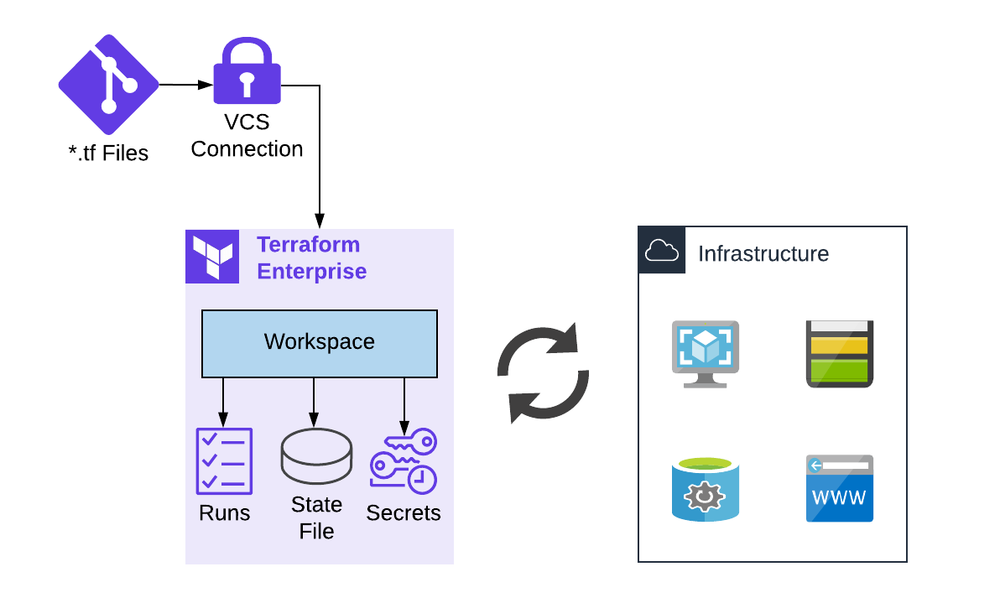
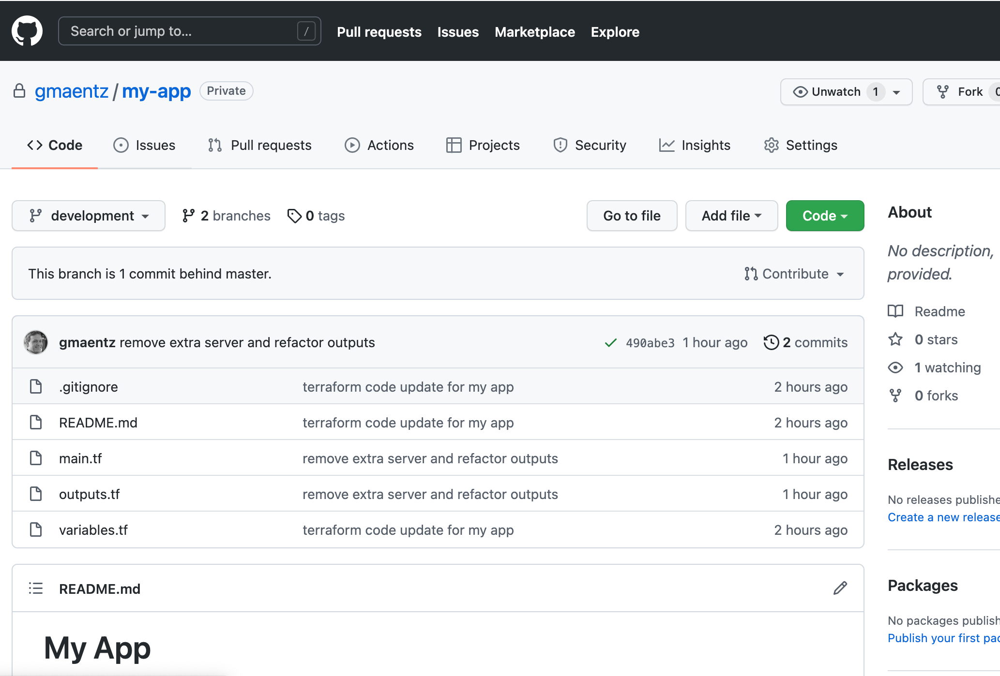
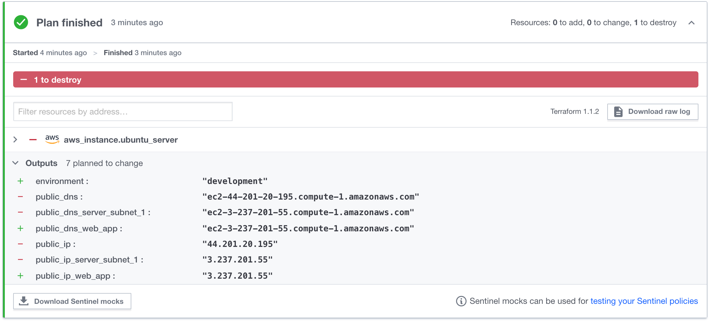
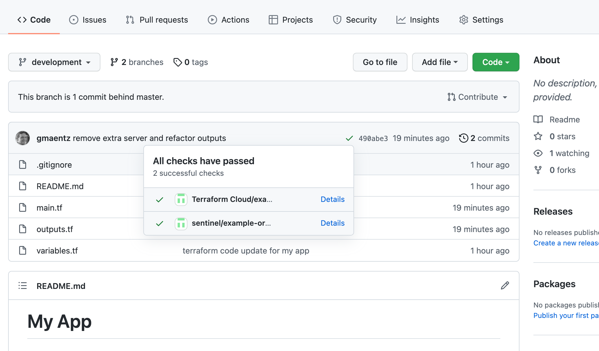

# Lab: Terraform Cloud - Version Control Workflow

Once multiple people are collaborating on Terraform configuration, new steps must be added to the core Terraform workflow (Write, Plan, Apply) to ensure everyone is working together smoothly. In order for different teams and individuals to be able to work on the same Terraform code, you need to use a Version Control System (VCS). The Terraform Cloud VCS or version control system workflow includes the most common steps necessary to work in a collaborative nature, but it also requires that you host the Terraform code in a VCS repository. Events on the repository will trigger workflows on Terraform Cloud. For instance, a commit to the default branch could kick off a plan and apply workflow in Terraform Cloud.



Terraform Cloud can integrate with the most popular VCS systems including GitHub, GitLab, Bitbucket and Azure DevOps. This lab demonstrates using the Terraform Cloud VCS workflow and it's native integrations with GitHub.

- Task 1: Create a new GitHub repository
- Task 2: Update your Repository and Commit Changes to GitHub
- Task 3: Migrate to the VCS workflow
- Task 4: Validate variables for each Terraform Cloud Workspace
- Task 5: Update TFC development workspace to use development branch
- Task 6: Use the VCS workflow to deploy an update to development
- Task 7: Use the VCS workflow to merge an update to production

## Task 1: Create a new GitHub repository

You will need a free GitHub.com account for this lab. We recommend using a personal account that was configured in previous labs. You can sign up or login in to an existing account at https://github.com/

Login to github and create a new repository by navigating to <https://github.com/new>

Use the following settings for the code repository

- Name: "my-app"
- Description: My AWS Application
- Private repo

Once created, connect the the repository to your local machine.

```bash
git init
git remote add origin https://github.com/<YOUR_GIT_HUB_ACCOUNT>/my-app.git
```

## Task 2: Update your Repository and Commit Changes to GitHub

In your repository create a `.gitignore` file to filter out any items we don't wish to check into version control at this time.

`.gitignore`

```
# Local .terraform directories
**/.terraform/*

# .tfstate files
*.tfstate
*.tfstate.*

# Crash log files
crash.log

# Ignore any .tfvars files that are generated automatically for each Terraform run. Most
# .tfvars files are managed as part of configuration and so should be included in
# version control.
#
# example.tfvars

# Ignore override files as they are usually used to override resources locally and so
# are not checked in
override.tf
override.tf.json
*_override.tf
*_override.tf.json

# Include override files you do wish to add to version control using negated pattern
#
# !example_override.tf

# Include tfplan files to ignore the plan output of command: terraform plan -out=tfplan
# example: *tfplan*
.DS_Store
tfc-getting-started/
*.hcl
terraform.tf
```

`README.md`

```md
# My App

In this repo, you'll find a quick and easy app to get started using [Terraform Cloud](https://app.terraform.io/) with [GitHub](https://github.com/).

## Version Control Workflow

Once multiple people are collaborating on Terraform configuration, new steps must be added to the core Terraform workflow (Write, Plan, Apply) to ensure everyone is working together smoothly. In order for different teams and individuals to be able to work on the same Terraform code, you need to use a Version Control System (VCS). The Terraform Cloud VCS or version control system workflow includes the most common steps necessary to work in a collaborative nature, but it also requires that you host the Terraform code in a VCS repository. Events on the repository will trigger workflows on Terraform Cloud. For instance, a commit to the default branch could kick off a plan and apply workflow in Terraform Cloud.

## Master Terraform by taking a Hands-On Approach

Check out the 70+ labs that follow the HashiCorp Certified: Terraform Associate certification. Learn more at https://cloudblitz.in
```

Commit the changes in GitHub.

```
git add .
git commit -m "terraform code update for my app"
git push --set-upstream origin master
```

## Task 3: Migrate to the VCS workflow

### Connect Terraform Cloud Workspace to the GitHub `my-app` repository

1. Navigate to <https://app.terraform.io> and click the `devops-aws-myapp-prod` workspace
2. Select Settings >> Version Control
3. Click the "Connect to version control"
4. Select the Version Control workflow
5. Click the VCS Connection in the "Source" section.
6. Verify you can see repositories and select the `my-app` github repository.

You can see that we are connected to our GitHub my-app project that we reviewed earlier. The `VCS branch` will denote which branch in GitHub that this workspace will be watching for changes. Since our triggering is set to `Always trigger runs`, any changes to our my-app project in the master branch of GitHub will trigger this workspace to run.

7. Select Update VCS Settings
8. Validate that a new Terraform run will occur on the workspace. Confirm and Apply the Terraform run.

## Task 4: Validate variables for each Terraform Cloud Workspace

Version control allows us to store our Terraform configuration in a centeralized location and reuse the same code base across branches withing our code repository. We however may wish to change a few specific settings to distiguish our development and production deployments. We will utilize Terraform variables within Terraform Cloud to specify these unique environment settings.

Update the variables for each of the `myapp` Terraform Cloud workspaces for the `environment` variable.

- Navigate to your Terraform Cloud `devops-aws-myapp-dev` in the UI.
- Once there, navigate to the `Variables` tab.
- Validate that there is a Terraform variable named `environment` with a value of `development`

Repeat these same steps for both the `devops-aws-myapp-prod`

- Navigate to your Terraform Cloud `devops-aws-myapp-prod` in the UI.
- Once there, navigate to the `Variables` tab.
- Validate that there is a Terraform variable named `environment` with a value of `production`

- Task 5: Use the VCS workflow to deploy an update to development
- Task 6: Promote changes via GitOps to production

## Task 5: Update TFC development workspace to use development branch

While each individual on a team still makes changes to Terraform configuration in their editor of choice, they save their changes to version control branches to avoid colliding with each other's work. Working in branches enables team members to resolve mutually incompatible infrastructure changes using their normal merge conflict workflow.

### 5.1 Create a Development Branch

In the `my-app` github repository, create a `development` branch from the `main` branch. Update your Terraform Cloud `devops-aws-myapp-dev` workspace to point to your `development` branch.

### 5.2 Connect Terraform Cloud Workspace to development branch

1. Navigate to <https://app.terraform.io> and click the `devops-aws-myapp-dev` workspace
2. Select Settings >> Version Control
3. Click the "Connect to version control"
4. Select the Version Control workflow
5. Click the VCS Connection in the "Source" section.
6. Verify you can see repositories and select the `my-app` github repository.
7. Specify `development` for the VCS Branch. The `VCS branch` will denote which branch in GitHub that this workspace will be watching for changes. Since this is the development workspace we will connect it to the `development` branch of our repository.
8. Select Update VCS Settings
9. Validate that a new Terraform run will occur on the workspace. Confirm and Apply the Terraform run.

## Task 6: Use the VCS workflow to deploy an update to development

### Version Control Branching and Terraform Cloud Workspaces

We will be using GitHub to promote a change to our app through Development and then into Production. Let's look how a change promotion would look in this configuration we outlined. We are going to start in our "Development" environment and move, or promote, that change to our production environments.

### 6.1 Pull down development branch locally:

The first step is to pull down the development code locally from the development branch of our repository. Currently this branch matches the main branch.

```bash
git branch -f development origin/development
git checkout development
```

> Note: If you are uncomfortable with the `git` commands you can choose to make your edits in GitHub directly through the web editor. This will limit some of the validation and plan commands

### 6.2 Perform infrastructure updates and refactor terraform code

Let's make a few changes in our development environment.

1. Removing additional Ubuntu server.
2. Remove the associate output blocks for this server.
3. Refactor our code to rename and move our application output blocks to an `outputs.tf` file

To remove the additional server, remove it's resource block from your `main.tf`

```
# Terraform Resource Block - To Build EC2 instance in Public Subnet
resource "aws_instance" "ubuntu_server" {
  ami                         = data.aws_ami.ubuntu.id
  instance_type               = "t2.micro"
  subnet_id                   = aws_subnet.public_subnets["public_subnet_1"].id
  security_groups             = [aws_security_group.vpc-ping.id, aws_security_group.ingress-ssh.id, aws_security_group.vpc-web.id]
  associate_public_ip_address = true
  key_name                    = aws_key_pair.generated.key_name
  connection {
    user        = "ubuntu"
    private_key = tls_private_key.generated.private_key_pem
    host        = self.public_ip
  }

  # Leave the first part of the block unchanged and create our `local-exec` provisioner
  # provisioner "local-exec" {
  #   command = "chmod 600 ${local_file.private_key_pem.filename}"
  # }

  provisioner "remote-exec" {
    inline = [
      "sudo rm -rf /tmp",
      "sudo git clone https://github.com/hashicorp/demo-terraform-101 /tmp",
      "sudo sh /tmp/assets/setup-web.sh",
    ]
  }

  tags = {
    Name = "Ubuntu EC2 Server"
  }

  lifecycle {
    ignore_changes = [security_groups]
  }
}
```

Let's also remove the `output` blocks that were referencing this resource block. Remove the following output blocks from your `main.tf`

```hcl
output "public_ip" {
  value = aws_instance.ubuntu_server.public_ip
}

output "public_dns" {
  value = aws_instance.ubuntu_server.public_dns
}
```

The last change will be to refactor our code to rename our output blocks and move them to an `outputs.tf` file. Remove the following blocks from our `main.tf`:

```
output "public_ip_server_subnet_1" {
  value = aws_instance.web_server.public_ip
}

output "public_dns_server_subnet_1" {
  value = aws_instance.web_server.public_dns
}
```

Create an `outputs.tf` file within our working directory with the following output blocks.

```
output "environment" {
  value = var.environment
}

output "public_ip_web_app" {
  value = aws_instance.web_server.public_ip
}

output "public_dns_web_app" {
  value = aws_instance.web_server.public_dns
}
```

Be sure that all of our changes are valid by performing a `terraform init` and `terraform validate`

```bash
terraform init -backend-config=dev.hcl -reconfigure
terraform validate
```

```
Success! The configuration is valid.
```

Now we can run a `terraform plan` to see the impact of our changes. Take notice what happens when we try to issue an apply for a workspace that is VCS connected.

```bash
terraform plan
terraform apply
```

```
| Error: Apply not allowed for workspaces with a VCS connection
|
| A workspace that is connected to a VCS requires the VCS-driven workflow to ensure that
| the VCS remains the single source of truth.
```

This is to be expected. Now that we are centrally storing all of our Terraform configuration inside version control, and have connected our Terraform Cloud workspaces to the version control workflow, all updates should be triggerd by commiting our code up into GitHub.

### 6.3 Commit changes to development branch

Now that our changes are valid, let's commit them to our development branch. Before we do, make sure you have both GitHub and Terraform Cloud web pages up to see the change being committed to the development branch with then triggers a Terraform Run inside our `devop-aws-myapp-dev` workspace.

```
git add .
git commit -m "remove extra server and refactor outputs"
git push
```



### 6.4 View Terraform Cloud VCS Workflow

Navigate to Terraform Cloud. You should see that a new run has been triggered within your `devop-aws-myapp-dev` workspace. You can view the details for the run to see that this was triggered by the code commit we just made on the development branch of our repository.




### 6.5 Confirm and apply our changes to development.

We can confirm and apply our changes to development environment from within Terraform Cloud.


## Task 7: Use the VCS workflow to merge an update to production

Now our changes have been applied in our development environment and we did our testing to confirm our application is functional, let's promote these changes to production. Let's look how a change promotion would look in this configuration we outlined.

1. Navigate back to GitHub. You should still be on the development branch with the ability to see the code changes that were made. We will be merging our changes we made in the development branch to our main branch. Click on the `Pull requests` option.
2. Select the `Compare & pull request` select `Change branches`. Our source branch will default to "development". Change the target branch to `main` and select `Create pull request`
3. Update the Title to `Promote to Production` and add a short description of your change.
4. For "Assignee" select `Assign to me`. We currently do not have users and groups setup in our environment but in a real world scenario we can put security controls around this approval process.
5. On the bottom of the page you can view what files and lines in those files are different between the development and stage branches. These are the changes that will be merged into our target branch.
6. Select `Create pull request`. We now have an opened a pull request. In our lab, approvals are optional but we could require multiple approvers before any changes get applied. We could deny the request and put a comment with details regarding why we denied it.
7. Click on the `Show all checks` next to the green check-mark.



8. Open the `Details` link in a new tab. As a pull request reviewer, you can use this to review the Terraform plan that was ran by the GitHub pipeline within the `devop-aws-myapp-dev` workspace.

We peer reviewed the changes everything looks good. Now go back to the tab we left open with our merge request and select the green `Merge pull request` button and `Confirm merge`.

Notice that another pipeline was started under where the merge button was. Right click on this new pipeline and open it in a new tab. You can use the external pipeline to link out to Terraform Cloud to review the apply. We could have also been watching the Terraform Cloud workspace list to see our workspaces auto apply from our merge request inside the `devop-aws-myapp-prod` workspace.

You can validate and open the URL of the app to confirm that our changes have been added. Terraform Cloud VCS workflows allows us to promote our change from development into production environment while maintaining isolation between these environments via Terraform workspaces. This ensures changes in the development branch have no impact to the production / main branch until a merge is performed.

## (Optional) Destroy infrastructure in appropriate workspace

If you would like to cleanup and destroy your infrastructure to keep costs down, that can be done at the workspace level. Navigate to the `Settings` of the workspace and select `Destruction and Deletion`. That will provide you with the ability to `Queue destroy plan` which follows the same workflow as a `terraform destroy`.
